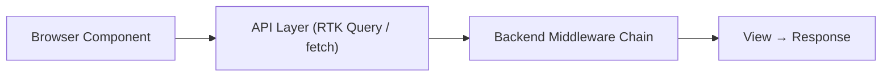
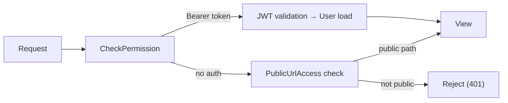
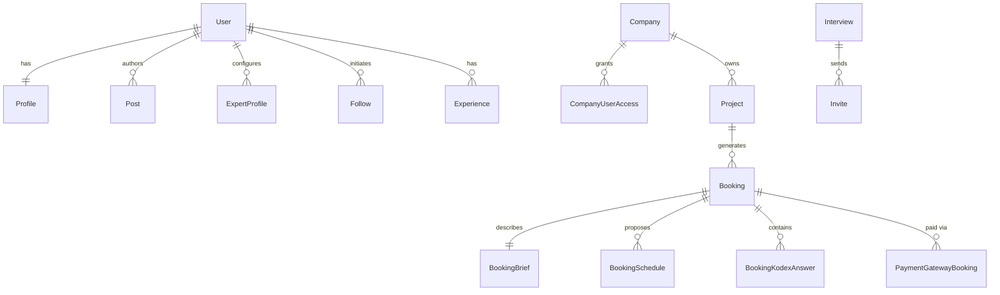
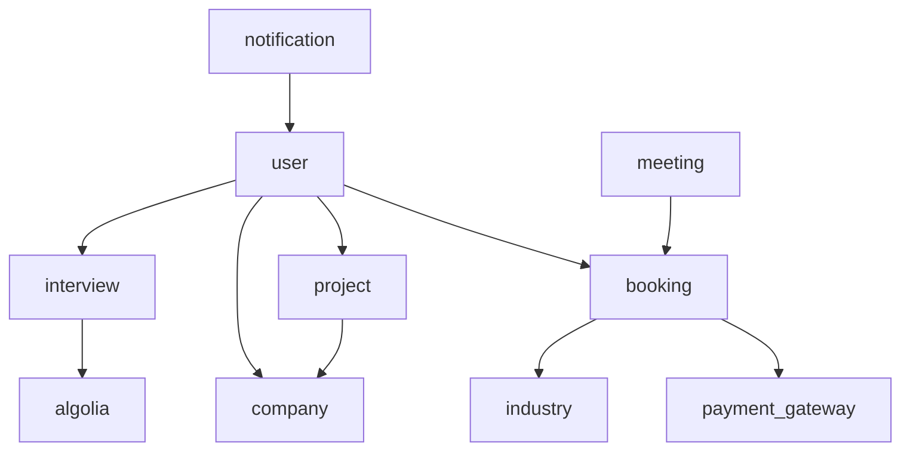

# /codemap — Codebase Mapping

Systematically scan a codebase and produce a feature-organized CODEMAP.md. Works for any multi-repo or single-repo project, any framework. The output is optimized for AI-assisted development — a new session can load the directory (~50 lines) and selectively read only the sections relevant to its task.

## Step 0: Resolve Config & Parse Mode

Read `~/.claude/aria-knowledge.local.md` and extract `knowledge_folder`. If the file doesn't exist, the skill still works — `knowledge_folder` is only needed for the knowledge extraction offer in Step 5.

**Parse the mode from arguments:**

| Argument | Mode | What it does |
|----------|------|-------------|
| (none) | Auto | If CODEMAP.md exists → prompt: "update or recreate?" Otherwise → `create` |
| `create` | Create | Full generation from scratch (Steps 1-8) |
| `inventory` | Inventory | Steps 1-2 only — detect + index, report to user, no file written |
| `update` | Update | Read existing CODEMAP.md, detect changes, refresh affected sections (Step 6) |
| `section <name>` | Section | Rebuild one specific section in an existing CODEMAP.md (Step 7) |

**Locate the project root:**
- If the current working directory contains a project-level CLAUDE.md, use that as the project root
- If inside a subdirectory of a project, walk up to find the nearest CLAUDE.md
- If unclear, ask the user: "Which directory is the project root?"

**Locate or create CODEMAP.md:**
- Default location: `{project_root}/CODEMAP.md`
- If the user specifies a different path, use that

For `inventory` mode, skip to Step 1 and stop after Step 2.
For `update` mode, verify CODEMAP.md exists. If it does, skip to Step 6. If not, tell the user: "No CODEMAP.md found — switching to create mode." and proceed with `create`.
For `section` mode, verify CODEMAP.md exists. If it does, skip to Step 7. If not, same fallback as update.
For `create` mode, proceed through Steps 1-5.

---

## Step 1: Detect Project Structure

Scan the project root for framework indicators:

**Backend detection:**
- `manage.py` + `settings.py` → Django (extract version from requirements.txt or pip)
- `package.json` with `express`/`fastify`/`hono`/`nestjs` → Node backend
- `Cargo.toml` → Rust
- `go.mod` → Go
- `Gemfile` with `rails` → Rails

**Frontend detection:**
- `next.config.*` or `package.json` with `next` → Next.js (extract version)
- `package.json` with `react` but no `next` → React SPA
- `package.json` with `vue`/`nuxt`/`svelte`/`sveltekit` → respective framework
- `app.json` or `expo` in package.json → React Native

**Repo structure detection:**
- Multiple directories each with their own `package.json` or `manage.py` → multi-repo
- Single root `package.json` with `workspaces` → monorepo
- Single app directory → single-repo

**Present detection results to user:**

```
## Project Detection

Root: /Users/.../ss
Structure: Multi-repo (2 repos)

| Repo | Framework | Version | Language |
|------|-----------|---------|----------|
| seersite-frontend/ | Next.js (App Router) | 13.5.2 | TypeScript |
| seersite-server/ | Django + DRF | 4.2.22 | Python |

Confirm or correct?
```

User confirms or corrects. Store the confirmed detection for subsequent steps.

---

## Step 2: Index Key Files

For each confirmed repo, scan for key file categories using framework-aware patterns.

### Django Backend Scanning

| Category | How to find | What to record |
|----------|-------------|----------------|
| **Apps** | Directories with `models/` or `models.py` + `views/` or `views.py` | App name, whether it has urls.py, admin.py |
| **Models** | `*/models/*.py` and `*/models.py` (exclude `__init__.py`) | Model class names via `^class \w+\(` grep |
| **Views** | `*/views/*.py` and `*/views.py` | View function/class names |
| **URLs** | `*/urls.py` + root `urls.py` | URL patterns, include() targets |
| **Config** | `settings.py`, `.env*`, `requirements.txt` | Framework version, installed apps, integrations |
| **Middleware** | `MIDDLEWARE` in settings.py, `*/middlewares/` | Custom middleware files |
| **Cron** | `CRONJOBS` in settings.py, `*/cron/*.py` | Cron job entries |
| **Utils** | `*/utils/*.py`, `*/utils.py` | Utility module names |

### Next.js / React Frontend Scanning

| Category | How to find | What to record |
|----------|-------------|----------------|
| **Pages/Routes** | `app/**/page.tsx` or `pages/**/*.tsx` | Route paths (derive from directory structure) |
| **Components** | `components/**/*.tsx` | Component directories and key files |
| **Hooks** | `hooks/*.ts` or `hooks/**/*.ts` | Hook names (extract from filenames) |
| **State** | `redux/`, `store/`, `context/` | Slice names, store shape |
| **API layer** | Files containing `createApi`, `apiSlice`, `fetch(` | API definition files |
| **Config** | `next.config.*`, `tsconfig.json`, `tailwind.config.*` | Key config values |
| **Middleware** | `middleware.ts` | What it does (read first 20 lines) |
| **Models/Types** | `models/`, `types/`, `interfaces/` | Type definition files |

### For Other Frameworks

Apply analogous patterns:
- **Express/Fastify:** scan `routes/`, `controllers/`, `models/`, `middleware/`
- **Rails:** scan `app/controllers/`, `app/models/`, `config/routes.rb`
- **React Native:** scan `src/screens/`, `src/navigation/`, `src/api/`

### Categorize Apps/Modules

Group discovered apps into tiers:
- **Core Domain** — apps with substantial models + views + URLs (the main business logic)
- **Reference/Taxonomy** — apps that primarily serve lookup data (small models, simple CRUD)
- **Support** — utility apps, content management, tracking

**Report inventory to user:**

```
## Inventory Summary

### seersite-server/ (Django 4.2)
Core Domain: user (30+ models), booking (12+ models), interview (7 models), project, company, payment_gateway, meeting
Reference: expertise, industry, market, school, degree, job_title, megatrends
Support: event_code, fee, blocks, issue, notation_notes, link_redirect, transcript_download, news_updates, notification, algolia, rating

### seersite-frontend/ (Next.js 13)
Pages: ~137 page.tsx files across /admin, /client, /dashboard, /expert, /auth, /profile, /works, /knowledge
Hooks: ~58 custom hooks
Components: ~243 .tsx files in 18 areas
Redux: 14 slices + RTK Query

Total: 10 core apps, 7 taxonomy apps, 11 support apps, 137 pages, 58 hooks
```

In `inventory` mode, **stop here** and output the report. Do not write any files.

---

## Step 3: Feature Detection

Using the indexed files from Step 2, identify features by clustering related files across repos.

**Detection heuristics:**

1. **Backend app → feature mapping:** Each Core Domain app is a candidate feature. Some apps combine into one feature (e.g., `booking` + `meeting` → "Expert Sessions & Bookings"). For non-Django backends, use controller/route directories as the grouping unit.

2. **Route prefix grouping:** Frontend routes that share a prefix map to the same feature:
   - `/dashboard/ai-interviews/*` → same feature as `interview/` backend app
   - `/dashboard/bookings/*` + `/client/dashboard/bookings/*` → same feature as `booking/` backend app

3. **Cross-cutting detection:** Some concerns span all features and get their own sections:
   - Auth (login, registration, JWT) → standalone section
   - Data flow (request lifecycle) → standalone section
   - Shared patterns (conventions that repeat everywhere) → standalone section

**Present proposed feature list to user:**

```
## Proposed Features

0. Project Identity & Stack
1. Data Flow Overview (request lifecycle, auth hydration, token refresh)
2. Entity Model (all models, ER diagram, app registry)
3. Auth & User Management (JWT, social login, registration, profiles)
4. AI Interviews (expert/client interviews, Ribbon, OpenAI)
5. Expert Sessions & Bookings (session lifecycle, calendar, Zoom)
6. Kodex Panels (async Q&A, expert answers, client management)
7. Expert Storefronts & Profiles (public profiles, storefront, marketplace)
8. Knowledge Library & Notation (search, transcripts, notes)
9. Insights / Feed (posts, social interactions)
10. Works & Research (works CRUD, purchases, downloads)
11. Payments (Stripe Connect, checkout, payouts)
12. Search (Algolia indexing and search UI)
13. Notifications (email, SMS, WebSocket)
14. Admin Tools (admin dashboard, approvals, content management)
15. Client Projects (project briefs, expert selection)

Cross-cutting:
C1. Shared Patterns & Conventions
C2. Common Change Patterns
C3. Integrations
C4. File Index
C5. Dependency Graph

Confirm, rename, merge, split, reorder, or add?
```

User validates the feature list. This becomes the section structure for the CODEMAP.

---

## Step 4: Write Sections (Output Order)

Write sections in the order they appear in the final file. **Write each section to CODEMAP.md immediately after mapping it** — don't buffer everything for the end. This prevents context loss on long mapping sessions.

Start by writing the file header (populated fully in Step 5):

```markdown
# {Project Name} Codemap

> Feature-organized codebase reference for AI-assisted development.
> Last updated: YYYY-MM-DD | Sections: N | Features: M
>
> **How to use:** Read the directory below (~N lines), then load specific
> sections with `Read CODEMAP.md offset=X limit=Y`.
> To find a section's line: `Grep "^## {number}\." CODEMAP.md`

## Directory

(placeholder — rebuilt in Step 5 after all sections are written)

---
```

Then write sections in this order:

### Section 0: Project Identity & Stack

Write from Step 1 detection results: framework versions, languages, key config files, env vars. If CLAUDE.md already covers this, keep brief and reference CLAUDE.md.

### Section 1: Data Flow Overview

Read these to build the section:
1. **API base configuration** — how the frontend makes API calls (base URL, auth headers, credentials)
2. **Auth middleware chain** — backend middleware order, JWT validation, permission checking
3. **Token refresh mechanism** — how 401s are handled, refresh flow, mutex/lock patterns
4. **Auth state hydration** — what happens on page load (localStorage, cookie checks, redirect logic)
5. **Frontend middleware** — URL rewrites, redirects
6. **Backend permission system** — how public vs. protected endpoints are distinguished
7. **Response formatting** — standard response shapes, error handling
8. **Storage** — where tokens, user data, and files are stored (cookies, localStorage, S3, etc.)

Use **Mermaid** for all diagrams — renderable in GitHub/Obsidian for team members, formally structured for Claude:





### Section 2: Entity Model

Build from the model files indexed in Step 2.

**App Registry table** — categorized by tier (Core Domain / Reference-Taxonomy / Support):

| App | Domain | Route prefix | Purpose |
|-----|--------|-------------|---------|
| **user** | Accounts, auth, profiles | `api/user/` | Central user entity |

**Mermaid ER diagram** — show core entity relationships:



Focus on **core domain models only** (10-15 entities max). Taxonomy and support models are listed in the App Registry table but don't need ER representation.

### Sections 3-N: Feature Sections

For each confirmed feature from Step 3, read the key files and trace the full stack. Process **one feature at a time** to manage context.

**Reading strategy per feature:**
1. URL/route files → identify all endpoints for this feature
2. Main view file(s) → function signatures, decorators, model queries, response patterns. For large files (1000+ lines), grep for `^def ` or `^class ` first, then read key functions selectively.
3. Model files → class definitions, field types, relationships
4. Frontend hooks → what they call, what state they manage
5. Frontend page components → only if the hook/route picture is unclear

**Each feature section contains:**

**Frontend spine:**

| Route | Purpose |
|-------|---------|
| `/path/to/page` | What the page does |

| Hook | What it does |
|------|-------------|
| `use-feature.ts` | Key behavior, which API endpoints it calls |

| Redux / API Endpoints | Method | Backend URL |
|----------------------|--------|-------------|
| `useXxxMutation` | POST | `/api/xxx` |

**Backend spine:**

| URL | View | Notes |
|-----|------|-------|
| `POST /api/xxx` | `view_function()` | Key behavior, permissions, issues |

**Models:** Key fields and relationships. Tables for simple listings, prose for complex relationships.

**Integrations:** If the feature touches external services — which service, what operations, key files, env vars.

**Security issues (inline):** Flag at the point they occur — IDOR, exposed secrets, missing validation, permission bypasses, anti-patterns. Bold the issue type:
> **IDOR:** `user_settings.py` accepts `user_id` from POST body without checking `request.user.id`

### Section C1: Shared Patterns & Conventions

After writing all feature sections, scan them for repeating patterns:
- Hook naming/structure conventions
- View/controller patterns
- Error handling patterns (including anti-patterns)
- Permission, state management, file storage, GUID/slug patterns

Document each pattern once with a brief description and an example file reference.

### Section C2: Common Change Patterns

For each detected framework, produce "how to" recipes:

**Django:** add endpoint, add model, add cron job, add email template, modify auth — which files to touch, which patterns to follow.

**Next.js / React:** add page, add API endpoint (frontend), add component, modify auth — directory structure, route constants, conventions.

Adapt to whatever frameworks were detected in Step 1.

### Section C3: Integrations

Summary table of all external services:

| Integration | Env Key(s) | Used by | Key files |
|-------------|-----------|---------|-----------|
| Stripe | `STRIPE_KEY`, `STRIPE_SECRET` | Payments (Section N) | `payment_gateway/views/` |

### Section C4: File Index

Per-repo "looking for X? it's in Y" tables:

| Looking for... | Location |
|----------------|----------|
| Django settings | `project/settings.py` |
| API base config | `redux/services/apiSlice.ts` |

### Section C5: Dependency Graph

Mermaid flowchart of app-to-app dependencies:



Build from import statements observed during deep mapping. Focus on app-to-app, not file-to-file.

### Build Log

Write at the end of the file:

| # | Section | Status | Updated |
|---|---------|--------|---------|
| 0 | Project Identity & Stack | Complete | YYYY-MM-DD |
| 1 | Data Flow Overview | Complete | YYYY-MM-DD |
| ... | ... | ... | ... |

---

## Step 5: Generate Directory & Finalize

After all sections are written, go back to the top of the file and:

1. **Build the directory table** from the actual section headings:

```markdown
## Directory

| # | Section | Covers | Key paths |
|---|---------|--------|-----------|
| 0 | Project Identity & Stack | frameworks, env vars, config | settings.py, next.config.js |
| 1 | Data Flow Overview | request lifecycle, auth, token refresh | apiSlice.ts, check_permission.py |
| ... | ... | ... | ... |
| C1 | Shared Patterns | conventions, anti-patterns | cross-cutting |
| C2 | Common Change Patterns | how to add endpoints, models, pages | procedural recipes |
| C3 | Integrations | external services, env keys | service summary |
| C4 | File Index | quick lookup tables | per-repo reference |
| C5 | Dependency Graph | app-to-app imports | adjacency list |
```

The **Covers** column should have enough keywords for Claude to match a task to a section without reading section content. The **Key paths** column lists file paths so Claude can match files it's already working on.

2. **Count the directory lines** (from `## Directory` to the first `---` separator) and update the "How to use" instruction with the actual count.

3. **Update the header** with final section/feature counts and today's date.

4. **Report stats:**

```
CODEMAP.md written: {total_lines} lines, {sections} sections, {features} features

Directory: lines 1-{N} (~{tokens} tokens to load)
Full file: ~{total_tokens} tokens
```

5. **Offer knowledge extraction:**
> "Mapping complete. I found {N} security issues and {N} patterns during scanning. Want me to run /extract to stage these to ARIA backlogs?"

---

## Step 6: Update Mode

When the user runs `/codemap update`:

### 6a. Read existing CODEMAP.md

Read the directory section (first ~80 lines). Extract:
- Section names and numbers
- Last-updated dates from the Build Log (read the last ~30 lines)

### 6b. Detect changes

Run: `git log --name-only --since="{last_update_date}" --pretty=format:"" -- {repo_paths}`

This gives all files changed since the last CODEMAP update. Also check for:
- New files in route/model/view/hook directories (Glob for files not referenced in the existing map)
- Deleted files that are still referenced in the map (Grep the map for paths, verify they exist)

### 6c. Map changes to sections

For each changed file, determine which section(s) it affects:
- Match file path against the "Key paths" column in the directory
- Match file path against file references within each section (Grep the CODEMAP)
- New files in a feature's directory → that feature's section needs refresh
- Changed models → Entity Model section + the feature section that uses them
- Changed config/middleware → Data Flow section
- Changed cross-cutting files → relevant C-section

### 6d. Present update plan

```
## Update Plan

Changes detected since YYYY-MM-DD:
- 12 files modified, 3 new files, 1 deleted file

Sections to refresh:
- ## 4. AI Interviews — interview/views/interview.py modified, 1 new model
- ## 11. Payments — payment_gateway/views/checkout.py modified
- ## C4. File Index — 3 new files to add
- ## Build Log — update dates

Sections unchanged: 0, 1, 2, 3, 5-10, 12-15, C1-C3, C5

Proceed? (all / numbers to skip / cancel)
```

### 6e. Refresh affected sections

For each section to refresh:
1. Re-run the deep mapping process (Step 4) for that feature only
2. Replace the section content in CODEMAP.md using Edit (match from `## N.` to next `## `)
3. Update the Build Log date for that section
4. If new features were detected, add them as new sections and update the directory

### 6f. Rebuild directory

After all sections are updated:
1. Regenerate the directory table from the current section headings
2. Update the directory line count in the "How to use" instruction
3. Update the `Last updated` date in the header

---

## Step 7: Section Mode

When the user runs `/codemap section <name>`:

1. Read the directory from the existing CODEMAP.md
2. Match `<name>` against section names (fuzzy match — "interviews" matches "AI Interviews")
3. If no match, present the section list and ask the user to pick
4. If matched, re-run the deep mapping process (Step 4) for that section
5. Replace the section content using Edit
6. Update the Build Log date
7. Rebuild directory (Step 5, directory rebuild only)

---

## Rules

### Process
- **Always present detection results and feature lists for user confirmation** before writing anything. The user's mental model of their codebase is authoritative.
- **One feature at a time** during deep mapping. Write each section before moving to the next. This prevents context loss on large codebases.
- **Inventory mode produces no files** — it's a read-only scan that reports to the user. Use it for quick orientation.
- **Update mode only touches affected sections** — never rewrite sections that haven't changed. Preserve user edits to sections (comments, annotations, corrections) unless the underlying code has changed.

### Content
- **Feature-organized, not repo-organized.** Every feature section traces the full stack: frontend routes → hooks → state → backend views → models → integrations. A developer working on "AI Interviews" should find everything in one section.
- **Security issues inline.** Flag IDOR, exposed secrets, missing validation, permission bypasses at the point where they occur in the feature section. Bold the issue type.
- **Mermaid for all diagrams.** Use Mermaid flowcharts for auth flows and dependency graphs, Mermaid erDiagram for entity relationships. Mermaid renders in GitHub, Obsidian, and VS Code for team members, and is formally structured for Claude. The small token premium (~500 tokens across all diagrams) is negligible with directory-based selective loading.
- **Be thorough but not exhaustive.** Document routes, views, models, hooks, and integrations. Don't document every line of code — the map is a navigation aid, not a code review.
- **Common Change Patterns are procedural.** Write them as step-by-step recipes: "to add X, touch files A, B, C in this order."
- **File Index answers "where is X?"** not "what does X do?" Keep entries to file path + brief purpose.

### Context Management
- **Large view/controller files (1000+ lines):** Don't read the whole file. Grep for function/class definitions first (`^def `, `^class `, `export function `), then read key functions selectively.
- **Large model files:** Read class definitions and field declarations. Skip method implementations unless they contain business logic that affects the feature map.
- **Endpoint files (like RTK Query slices):** Grep for endpoint names and URL patterns rather than reading the full file.

### Maintenance
- **Build Log tracks per-section status.** Every section gets a status (Complete/Partial/Scaffolded) and a date. Update mode uses these dates to detect staleness.
- **Directory is self-maintaining.** The skill rebuilds the directory table and line count instruction whenever it writes or updates the file.
- **`---` separators between sections** are mandatory — they serve as visual breaks and as Grep anchors for section boundaries.

### Integration
- **After create or update, offer /extract.** Security issues and patterns discovered during mapping are valuable knowledge that should flow into ARIA backlogs.
- **Don't duplicate CLAUDE.md content.** If project identity info already exists in CLAUDE.md, keep the CODEMAP's Section 0 brief and reference CLAUDE.md for details. The CODEMAP's value is the feature mapping, not restating what CLAUDE.md already covers.
